<div align="center">
  
```
  ╔══════════════════════════════════════════════════════════════╗
  ║                                                              ║
  ║   🎨 Welcome to Raghavendra's Tech Universe! 🚀             ║
  ║                                                              ║
  ╚══════════════════════════════════════════════════════════════╝
```

[](https://git.io/typing-svg)

</div>

<div align="center">
  
```
 ┌────────────────────────────────────────┐
 │   "Turning Coffee into Code Since... ☕️ │
 │   Let's just say it's been a while!"   │
 └────────────────────────────────────────┘
```

</div>

## 🎮 Tech Skill Tree 

```mermaid
mindmap
  root((Raghavendra's Skills))
    Languages
      Python 🐍
      Java ☕
      C++ 🔧
      C ⚡
    Frontend
      Flutter 📱
      React ⚛️
    Backend
      Node.js 🚀
      Express 🛤️
    Databases
      MySQL 📊
      MongoDB 🍃
      Firebase 🔥
    DevOps
      Docker 🐳
      Kubernetes ⎈
      Git 📚
    Cloud
      AWS ☁️
      Google Cloud ⛅
```

<div align="center">



</div>

## 🌟 Achievement Unlocked!

<div align="center">

```
Level 99 Problem Solver
★★★★★ Code Quality
⚡ Fast Learner
🏆 Team Player
```

</div>

## 🎯 Current Side Quests

<div align="center">

```
╔═══════════════════════╗
║  MISSIONS IN PROGRESS ║
╚═══════════════════════╝

[▓▓▓▓▓▓▓▓▓▓▓▓░░░] 80% Cloud Architecture Mastery
[▓▓▓▓▓▓▓▓░░░░░░] 65% System Design Expertise
[▓▓▓▓▓▓▓░░░░░░░] 60% Open Source Contributing
[▓▓▓▓▓▓▓▓▓▓░░░░] 75% Advanced Algorithms
```

</div>

## 🏆 Boss Battles (Projects)

<div align="center">

<table>
  <tr>
    <td align="center">
      <div style="border: 2px solid #7C3AED; border-radius: 10px; padding: 10px;">
        <a href="https://github.com/Raghavendra-Reddy-Padala/Project-Name">
          
          <br />
          <sub><b>🚀 CloudScale</b></sub>
        </a>
        <br />
        <sub>Level: Legendary</sub>
        <br />
        <sub>Tech: AWS, Docker, K8s</sub>
      </div>
    </td>
    <td align="center">
      <div style="border: 2px solid #7C3AED; border-radius: 10px; padding: 10px;">
        <a href="https://github.com/Raghavendra-Reddy-Padala/Another-Project">
          
          <br />
          <sub><b>🔐 SecureVault</b></sub>
        </a>
        <br />
        <sub>Level: Epic</sub>
        <br />
        <sub>Tech: Python, React, MongoDB</sub>
      </div>
    </td>
  </tr>
</table>

</div>

## ⚔️ Github Battle Stats

<div align="center">

```
╔════════════════════════════════════════╗
║           GITHUB STATS                 ║
╚════════════════════════════════════════╝
```


</div>

## ⚔️ LeetCode Battle Stats

<div align="center">

```
╔════════════════════════════════════════╗
║           LEETCODE STATS               ║
╚════════════════════════════════════════╝
```


</div>

## 🌐 Join My Quest!

<div align="center">

```
⚡ CONNECT WITH THE WIZARD ⚡
```

[](mailto:raghavareddy696969@gmail.com)
[](https://www.linkedin.com/in/raghavendra-reddy-padala-28bbb6256/)
[](https://leetcode.com/raghavareddy121212/)

</div>

## 🎮 Character Stats

<div align="center">

```
╔══════════════════╗
║  SPECIAL MOVES   ║
╚══════════════════╝

⚡ Debug Dance Master
🎯 Architecture Ace
💡 Solution Seeker
🌟 Code Quality Guardian
```

</div>

---

<div align="center">
  

```
🎮 Game Over? Never! Let's Build Something Amazing! 🚀
```

</div>
